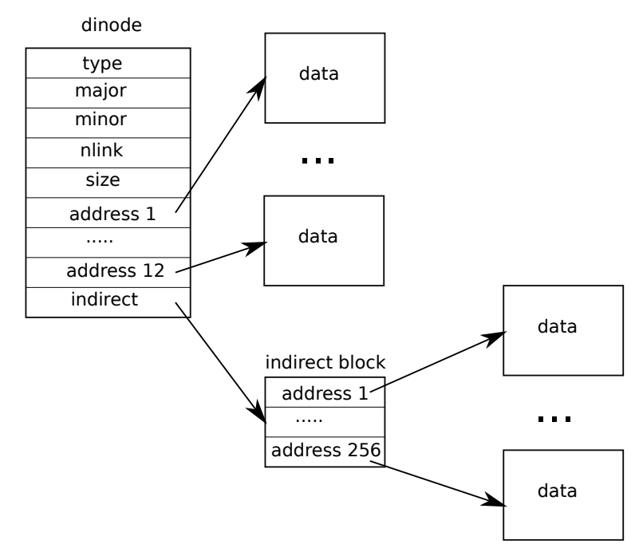

# [Lab File System](https://pdos.csail.mit.edu/6.828/2021/labs/fs.html)

## Large Files *(moderate)*

This task requires us to modify the inode structure to extend the maximum file size. The original inode data consists of 12 direct links and 1 single-level indirect links:



The new structure will change one direct link to a double-indirect link:


The `NDIRECT` and `MAXFILE` macros will be changed.

```c
#define NDIRECT 11
#define NINDIRECT (BSIZE / sizeof(uint))
#define MAXFILE (NDIRECT + NINDIRECT + NINDIRECT * NINDIRECT)

// On-disk inode structure
struct dinode {
  short type;           // File type
  short major;          // Major device number (T_DEVICE only)
  short minor;          // Minor device number (T_DEVICE only)
  short nlink;          // Number of links to inode in file system
  uint size;            // Size of file (bytes)
  uint addrs[NDIRECT+2];   // Data block addresses
};
```

Now if we allocate a new data block for an inode, we have to consider the case of double-indirect link when we call `bmap`:

1. Given the address array, find the index according to the given logical block number (3 cases: direct, 1-level indirect, or 2-level indirect).
2. If the corresponding address is empty, allocate a new block and create the link in the current block.
3. Write the block to log so that the updated address is available on disk. (except the first level, because the input inode is cached in memory and its `log_write` will be finished elsewhere)
4. Go to the sub-level block. Repeat the previous steps until the next block is data block.

- code

    ```c
    // kernel/fs.c
    static uint bmap(struct inode *ip, uint bn)
    {
      uint addr, *a, num;
      struct buf *bp, *bp2;
    
      if(bn < NDIRECT){
        ...
      }
      bn -= NDIRECT;
    
      if(bn < NINDIRECT){
        ...
      }
      bn -= NINDIRECT;
    
      if (bn < NINDIRECT * NINDIRECT) {
        // Load doubly-indirect block, allocating if necessary.
        if((addr = ip->addrs[NDIRECT + 1]) == 0)
          ip->addrs[NDIRECT + 1] = addr = balloc(ip->dev);
    
        // go to d-indirect block (1st level entries)
        bp = bread(ip->dev, addr);
        a = (uint*)bp->data;
        num = bn / NINDIRECT;
        if ((addr = a[num]) == 0) {
          a[num] = addr = balloc(ip->dev);
          log_write(bp);    // update entry in d-indirect block
        }
        brelse(bp);
    
        // go to the 2nd level entries
        bp2 = bread(ip->dev, addr);
        a = (uint*)bp2->data;
        num = bn % NINDIRECT;
        if ((addr = a[num]) == 0) {
          a[num] = addr = balloc(ip->dev);
          log_write(bp2);    // update entry in 2nd level block
        }
        brelse(bp2);
        return addr;
      }
    
      panic("bmap: out of range");
    }
    
    void itrunc(struct inode *ip)
    {
      int i, j;
      struct buf *bp, *bp2;
      uint *a, *a2;
    
      for(i = 0; i < NDIRECT; i++){
        ...
      }
    
      if(ip->addrs[NDIRECT]){
        ...
      }
    
      if (ip->addrs[NDIRECT + 1]) {
        // 1st level
        bp = bread(ip->dev, ip->addrs[NDIRECT + 1]);
        a = (uint *)bp->data;
        for (j = 0; j < NINDIRECT; j++) {
          if (a[j]) {
            // 2nd level
            bp2 = bread(ip->dev, a[j]);
            a2 = (uint *)bp2->data;
            for (j = 0; j < NINDIRECT; j++) {
              if (a2[j])
                bfree(ip->dev, a2[j]);
            }
            brelse(bp2);
            bfree(ip->dev, a[j]);
          }
        }
        brelse(bp);
        bfree(ip->dev, ip->addrs[NDIRECT + 1]);
        ip->addrs[NDIRECT + 1] = 0;
      }
    
      ip->size = 0;
      iupdate(ip);
    }
    ```

## Symbolic Links *(moderate)*

The `link()` system call creates a new directory entry pointing to the underlying inode. It only creates a pathname and increments the link count of the inode.

Instead of referencing an inode, **a symbolic link reference another pathname**. The target pathname can be invalid (not exists), point to a normal file/inode or be another symbolic link. To save the target path string, I create an inode for each symbolic link and write it to data blocks when calling `symlink()`. What differs from `link()` is that **every symbolic link contains a real inode, not just a mapping between directory entry and inode.**

The whole task can be split into link file creating and opening.

### Create a link

Symbol link is identified as `T_SYMLINK` for `inode.type`. System call `symlink()` will do two things:

1. Create an inode at given path. `create()` has done a lot for us:
    1. Walk down the directories from the root until the parent directory of `path`.
    2. Look up the filename in the current directory. Return null if the link inode is found.
    3. If not found, allocate a new inode for symbolic link and update its type as `T_SYMLINK`.
    4. Add its inode number and filename into the directory.
2. Write the target pathname to the data blocks in the link inode. See `writei()` for help.

- code

    ```c
    // kernel/sysfile.c
    uint64 sys_symlink(void)
    {
      char target[MAXPATH];
      char path[MAXPATH];
      uint tlen, plen;
      struct inode *ip;
    
      if ((tlen = argstr(0, target, MAXPATH)) < 0 || (plen = argstr(1, path, MAXPATH)) < 0)
        return -1;
    
      begin_op();
    
      if ((ip = create(path, T_SYMLINK, 0, 0)) == 0) {
        end_op();
        return -1;
      }
    
      // ilock(ip);
      if (writei(ip, 0, (uint64)target, 0, tlen) != tlen) {
        iunlockput(ip);
        end_op();
        return -1;
      }
      iunlockput(ip);
      end_op();
      return 0;
    }
    ```

### Open a link

When the user opens the symbolic link file, he actually wants to open the file at target path. So we should modify the `open` system call for taking symbolic link files into consideration: When the opened file is a symbolic link, we retrieve the actual path from its data blocks and open the new file instead.

However, there are some problems:

- The underlying target file may be another symbolic link. So we cannot directly return the 1st-level inode number but have to **recursively follow the links**.
- It is even worse that the target files are all symbolic links and they form a cycle. This case leads to infinite loop in the follow process. **We should use a level counter to record the current search depth. If it exceeds the threshold, `open` will incur an error.**
- The target pathname is not checked in the `symlink()`, which means it is our job to validate it in the `open()`. During the follow process, each time we need to check the existence of the corresponding directory entry and operate differently based on the inode type:
  - file: break from the search loop → allocate a file entry and a file descriptor entry in the two tables (file: system-wise, fd: process-wise), update its read/write flags, return the file descriptor `fd`.
  - symbolic link: increment the counter and check for cycle threshold. If we choose to continue following, we will read the target path from data blocks in the underlying inode (see `readi()` for help) and repeat the above steps.
- If `O_NOFOLLOW` is set in the input mode, user wants to open the inode of symbolic link rather than the target file. We can regard the symbolic file as a normal file and reuse the code.
- code

    ```c
    // kernel/sysfile.c
    uint64 sys_open(void)
    {
      ...
    
      if(omode & O_CREATE){
        ...
      } else {
        if((ip = namei(path)) == 0){
          end_op();
          return -1;
        }
        ilock(ip);
        if(ip->type == T_DIR && omode != O_RDONLY){
          iunlockput(ip);
          end_op();
          return -1;
        } else if (ip->type == T_SYMLINK && !(omode & O_NOFOLLOW)) {
          char temp_path[MAXPATH];
          int cnt = 10;
          while (cnt > 0) {
            // read the target path
            if (readi(ip, 0, (uint64)temp_path, 0, ip->size) != ip->size) {
              iunlockput(ip);
              end_op();
              return -1;
            } 
            // find the corresponding file
            iunlock(ip);
            if ((ip = namei(temp_path)) == 0) {
              // target file not exists
              end_op();
              return -1;
            }
            ilock(ip);
            // based on the file type, operate differently
            if (ip->type == T_FILE) {
              break;
            } else if (ip->type == T_DIR) {
              panic("open symlink to a directory");
            } else if (ip->type == T_SYMLINK) {
              cnt--;
            }
          }
          if (cnt == 0) {
            // the following count has passed the threshold -> cyclic links
            iunlockput(ip);
            end_op();
            return -1;
          }
        }
      }
    
      ...
    
      return fd;
    }
    ```
