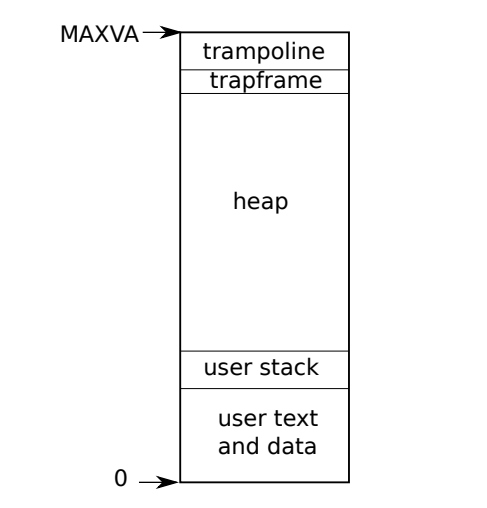

# [Lab Mmap](https://pdos.csail.mit.edu/6.828/2021/labs/mmap.html)

## Mmap *(hard)*

This lab will implement the `mmap` and `munmap` system calls for xv6, which relates to concepts including file read/write, page table, page fault handler and system call implementation. It’s definitely a hard and error-prune work😫. (My answer cannot guarantee 100% safety. I listed some safety issues in my implementation below for you to improve.) I finish this task by following the official hints, but there is still something to point out:

### `mmap()`

The core idea in this lab is to **implement the mmap VM mapping and the actual page table mapping asynchronously!**

Users can have their illusion that the file has been mapped to the returned address and all bytes are available to read or write. But the kernel delays the actual VM mapping and file reading by using page fault handlers.

When the user calls `mmap()`, the kernel checks the file permissions and records the mmap area in the process table `proc.mmapareas[16]`:

```c
struct vma {
 int valid;              // is this area struct avaiable for use?
  uint64 start;           // original address of the mmap area (for calculating the file offset)
  uint64 addr;            // current address of the mmap area (file offset may have been changed by munmap())
  int length;             // area size
  int permissions;        // prot
  int shared;             // shared or private
  struct file *fp;        // underlying file
};

struct proc {
  ...
  struct vma *mmapareas[16];   // Virtual Memory-Mapped areas
};
```

- code for `vma` allocation, free, and address search

    ```c
    // kernel/proc.c
    static struct vma vmareas[16];
    static struct spinlock vma_lock;
    
    // allocate vma area in the array
    // return 0 if error
    struct vma *vma_alloc() {
      acquire(&vma_lock);
    
      for (int i = 0; i < 16; i++) {
        // check whether the entry is free
        if (vmareas[i].valid == 0) {
          vmareas[i].valid = 1;
          release(&vma_lock);
          return &vmareas[i];
        }
      }
    
      // no free entries in the vma array
      release(&vma_lock);
      return 0;
    }
    
    int vma_free(struct vma *area) {
      if (area == 0)
        return -1;
    
      acquire(&vma_lock);
      if (area->valid == 0)
        panic("vma free a freed entry");
      area->valid = 0;
      release(&vma_lock);
      return 0;
    }
    
    // Return the area pointer if va is in one of the mapped areas
    struct vma *whicharea(void *va) {
      struct proc *p = myproc();
      for (int i = 0; i < 16; i++) {
        if (p->mmapareas[i] && p->mmapareas[i]->valid) {
          uint64 start = (uint64)p->mmapareas[i]->addr;
          if ((uint64)va >= start && (uint64)va < start + p->mmapareas[i]->length)
            return p->mmapareas[i];
        }
      }
      return 0;
    }
    ```

But the `mmap()` system calls doesn’t map the area in its address space now. So any visit to that area will incur a page fault, even if `mmap()` succeeds.

- code for `mmap()`

    ```c
    void* mmap(void *addr, int length, int prot, int flags, int fd, int offset)
    {
      if ((addr = findarea(length)) == 0) {
        // no area is available
        printf("mmap: no area is available\n");
        return (char *)-1;
      }
    
      // allocate a new vma struct
      struct proc *p = myproc();
      struct vma *area = vma_alloc();
      if (area == 0)
        panic("mmap: no free entry");
      area->start = area->addr = (uint64)addr;
      area->length = length;
      area->shared = flags;
      // validate fd
      if (fd < 0 || fd >= 16 || p->ofile[fd] == 0 || p->ofile[fd]->type != FD_INODE) {
        goto bad;
      }
      area->fp = p->ofile[fd];
      // validate r/w permissions: read-only mmap allows for PRIVATE, not SHARED
      if ((prot & PROT_READ) && !(area->fp->readable))
        goto bad;
      else if ((prot & PROT_WRITE) && !(area->fp->writable) && (flags & MAP_SHARED))
        goto bad;
      area->permissions = prot;
    
      // Add this struct to the process's mmap table
      for (int i = 0; i < 16; i++) {
        if (p->mmapareas[i] == 0) {
          p->mmapareas[i] = area;
          filedup(area->fp);
          return (void *)area->addr;
        }
      }
    
    bad:
      if (vma_free(area) < 0)
        panic("mmap: vma free error");
      return (char *)-1;
    }
    ```

Page fault handler will actually do the mapping work:

1. Allocate a new physical page and map it in the page table.
2. Copy data by reading bytes from the inode (or 0 if the range of mmap area exceeds the file size)

Each time the instruction incurs a page fault, the kernel only maps the current page not the whole file into address space.

- code for page fault handler

    ```c
    // kernel/trap.c
    // validate the faulting va first in the usertrap()
    int pgfault_mmap(uint64 fva, int write) {
      struct vma *area = whicharea((void *)fva);
      int readable = !!(area->permissions & PROT_READ);
      int writable = !!(area->permissions & PROT_WRITE);
      if (!readable) {
        printf("mmap: visit a non-read area, fva = %p\n", fva);
        return -1;
      }
      if (write && !writable) {
        // write to a read-only area
        return -1;
      }
    
      struct proc *p = myproc();
    
      // allocate a physical page to be mapped at fva
      void *mem = kalloc();
      if (mem == 0)
        return -1;
      memset(mem, 0, PGSIZE);
      // copy data from the file to this allocated page
      uint64 va = PGROUNDDOWN(fva);
      int off = va - (uint64)area->start;
      struct inode *ip = area->fp->ip;
      ilock(ip);
      if (off < ip->size && readi(ip, 0, (uint64)mem, off, PGSIZE) <= 0) {
        kfree(mem);
        iunlock(ip);
        return -1;
      }
      iunlock(ip);
      // printf("pgfault: constructed physical page from file\n");
    
      // map it to user space
      int perm = PTE_U;
      if (readable) perm |= PTE_R;
      if (writable) perm |= PTE_W;
      if (mappages(p->pagetable, va, PGSIZE, (uint64)mem, perm) != 0) {
        kfree(mem);
        return -1;
      }
      // printf("pgfault: map page ok\n");
    
      return 0;
    }
    ```

### `munmap()`

Users call `munmap()` to remove parts of the mmap area allocated by `mmap()` first. The kernel will do the following things:

1. Find the area that users want to unmap.
2. Determine the actual area that will be unmapped. (This lab will only unmap from the start, until the end, or the whole area)
3. Write back the unmapped bytes to the file if it is shared.
4. Remove mappings in the page table and free the physical memory.
5. Update the information for the remaining mmap area. If the area is removed completely, decrement the references to the file and free the `vma` entry in the table.

- code for `munmap()`

    ```c
    int munmap(uint64 addr, int length) {
      // unmap range is either at start, at end or the whole area
      struct vma *range = whicharea((void *)addr);
      if (range == 0) {
        return -1;
      }
    
      uint64 start, end;  // remaining valid range
      uint64 free_start;  // the starting address of freed page
      int npages;         // number of pages to be freed
      struct proc *p = myproc();
      if (addr + length == range->addr + range->length && length <= range->length) {
        // until the ending address
        start = range->addr;
        end = addr;
        free_start = PGROUNDUP(addr);
        npages = (addr + length - PGROUNDUP(addr) + PGSIZE - 1) / PGSIZE;
      } else if (addr == range->addr && length < range->length) {
        // from the starting address
        start = addr + length;
        end = range->addr + range->length;
        free_start = addr;
        npages = length / PGSIZE;
      } else {
        // out of range
        return -1;
      }
    
      // write modified pages back to file & free memory
      if (range->shared & MAP_SHARED) {
        filewrite_off(range->fp, addr - range->start, addr, length);
      }
      uvmunmap_pass(p->pagetable, free_start, npages); // neglect the unmapped ptes
    
      // update the mmaped range
      range->addr = start;
      range->length = end - start;
      if (range->length == 0) {
        // remove the whole range
        fileclose(range->fp);     // decrement the refcnt
        // free the vm area entry in the table
        for (int i = 0; i < 16; i++) {
          if (p->mmapareas[i] == range)
            p->mmapareas[i] = 0;
        }
        if (vma_free(range) < 0)
          panic("munmap: vma free");
      }
      return 0;
    }
    ```

    <aside>
    💡 **Area unmapping should be conservative**, which means we should unmap and free a page only if this page is completely surrounded by the unmapped area. If the user wants to visit any address later, we should keep the corresponding page untouched. (see `PGROUNDUP(addr)` for inspiration. I only considered the 3 specific cases)

    </aside>

### Find a Free Area

In this lab, the input `addr` of `mmap()` will always be 0, which means the kernel need to find an available region in the address space to fit such a mmap area.



User address layout of a xv6 process

The available address space is beyond the heap area. However, the heap grows upwards and its size is increased by calling `sbrk()`. I chose to find an free range from the top page (the page under trapframe) and **search downwards in order to avoid collision with the heap expansion**.

<aside>
💡 It is complicated to avoid collision completely with the heap area, especially when user calls `sbrk()` and visits the mmap area alternately.
An extreme example: After we finish searching in the `mmap()` and record the available range in the table but before we actually map the page in the page fault handler, the heap has grown aggressively and invades the mmap area.

</aside>

How to find such an area?

1. Limit the searching range. `p->size < addr < p->trapframe`
2. For each page in the searching range, check whether it has been used in one of the mmap areas.
3. If a series of free pages have satisfied the length requirement, we can record this area in the mmap table of the process.

- code for searching an available mmap area

    ```c
    // kernel/proc.c
    // Look up the process's page table for a free region used in mmap()
    // Return the beginning virtual address or 0 if no area is available
    void *
    findarea(int size) {
      // how many pages at most should the process allocate for this file
      int max_pages = (size + PGSIZE - 1) / PGSIZE;
    
      struct proc *p = myproc();
    
      uint64 va = (uint64)p->trapframe - PGSIZE;
      int avail_pages = 0;
      for (; va > p->sz; va -= PGSIZE) {
        if (whicharea((void *)va) != 0) {
          // has been mapped to a vmarea
          continue;
        }
        if (walkaddr(p->pagetable, va) == 0) {
          // not in the heap area, increment the available page counter
          if (++avail_pages == max_pages)
            return (void *)va;
        }
        else {
          // the mmaped area has gone beyond the heap
          return 0;
        }
      }
      return 0;
    }
    ```

### Asynchronization Problem in `munmap()`

The core idea in `mmap()` is asynchronization, but the biggest problem in `munmap()` is also asynchronization.

The page table is not updated immediately after calling `mmap()`. There exists a period that an area has been recorded for mmap usage, but the page handler has not finished the mapping steps. If user calls `munmap` in this period and the target area exactly intersects the unmapped area, what will happen?

The write-back and unmapping steps will definitely fail because the virtual addresses in these functions are invalid. If we call `writei()` and `uvmunmap()` now, they will either return an error or panic. So how can we deal with the problem?

Let’s review the logic:

> page table hasn’t mapped the page → the corresponding page fault hasn’t been incurred → user hasn’t accessed this page
>

**The unmapped page is never used.**

- Do we need to write it back to the file? - No.
- Do we need to unmap this non-existing page in the page table? - No.

We can “do nothing” to solve the asynchronization problem. Neglect the address error returned by `writei()` and refactor the code in `uvmunmap()` to pass the invalid ptes.

- functions used in `munmap()`

    ```c
    // kernel/file.c
    // filewrite() with offset support
    int filewrite_off(struct file *f, int off, uint64 addr, int n)
    {
      int max = ((MAXOPBLOCKS - 1 - 1 - 2) / 2) * BSIZE;
      int i = 0, r = 0;
      while (i < n) {
        int n1 = n - i;
        if (n1 > max)
          n1 = max;
    
        begin_op();
        ilock(f->ip);
        if ((r = writei(f->ip, 1, addr + i, off, n1)) > 0)
          off += r;
        iunlock(f->ip);
        end_op();
    
        if (r != n1) {
          // error from writei
          break;
        }
        i += r;
      }
      return i;
    }
    
    // Remove npages of mappings starting from va. va must be
    // page-aligned. The mappings may not exist.
    // Free the physical memory.
    void uvmunmap_pass(pagetable_t pagetable, uint64 va, uint64 npages)
    {
      uint64 a;
      pte_t *pte;
    
      if((va % PGSIZE) != 0)
        panic("uvmunmap: not aligned");
    
      for(a = va; a < va + npages*PGSIZE; a += PGSIZE){
        if((pte = walk(pagetable, a, 0)) == 0)
          continue;
        if((*pte & PTE_V) == 0)
          continue;
        if(PTE_FLAGS(*pte) == PTE_V)
          continue;
        uint64 pa = PTE2PA(*pte);
        kfree((void *)pa);
        *pte = 0;
      }
    }
    ```

    <aside>
    💡 `writei` will return a short value if it encounters the unmapped region. In this lab, we assume that all the pages behind the first error page are invalid, so we can `break` and return in `filewrite_off`. However, if some part of the latter pages is valid, my code will not write them back to file.

    </aside>
