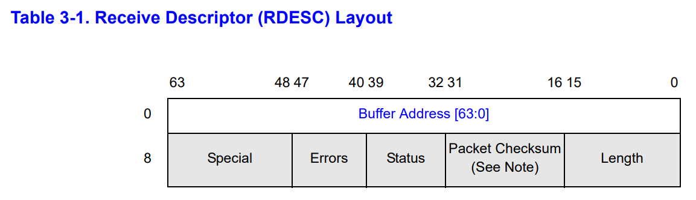
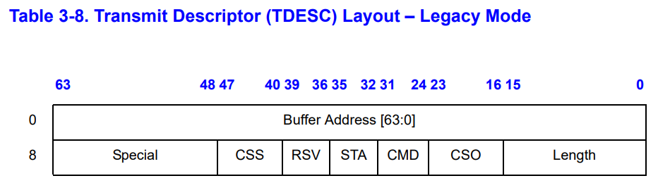
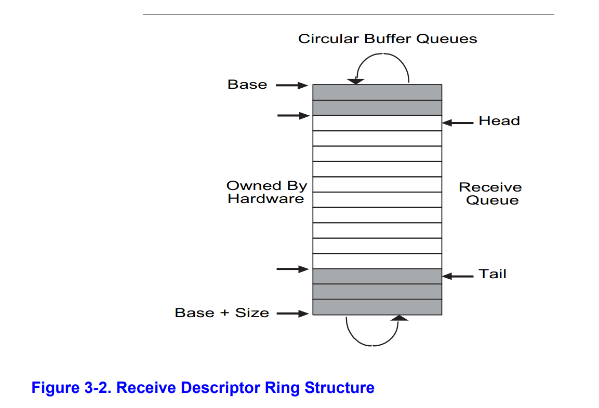

# [Lab Network Driver](https://pdos.csail.mit.edu/6.828/2021/labs/net.html)

## Your Job *(hard)*

This is definitely a hard and time-consuming lab if you read through the device manual for programming. However, the given hints are useful enough to finish this task. Instead of repeating the hints, I will write about the code structures in the e1000 driver.

### Descriptor & Buffer

The e1000 device uses direct memory access (DMA) technique to access the transmitted/received data in RAM. In order to specify the memory address of the data, driver provides the information in descriptors.

- Each descriptor is a 16-byte structure:

    

    The packet received will be placed at the buffer address. The remaining bytes are necessary information about the received packet.

    

    E1000 will read `length` bytes starting from the buffer address to its internal FIFO buffer and transmit the packet. Sending commands is in the `cmd` byte.

- The buffer address is the starting position of valid data (`head`) in the `mbuf.buf`:

    ```c
    struct mbuf {
      struct mbuf  *next; // the next mbuf in the chain
      char         *head; // the current start position of the buffer
      unsigned int len;   // the length of the buffer
      char         buf[MBUF_SIZE]; // the backing store
    };
    ```

    The net device has no idea about `mbuf`, driver code manages its allocation and free. (see `mbufalloc()` and `mbuffree()`, which calls the physical memory manager in `kalloc.c`)

### Descriptor Ring

To maximize throughput, e1000 uses **a circular array of descriptors** (or buffers) to support consecutive operations. Device can access its base address, head/tail pointers and length from memory-mapped registers.



```c
 // [E1000 14.5] Transmit initialization
  memset(tx_ring, 0, sizeof(tx_ring));
  for (i = 0; i < TX_RING_SIZE; i++) {
    tx_ring[i].status = E1000_TXD_STAT_DD;
    tx_mbufs[i] = 0;
  }
  regs[E1000_TDBAL] = (uint64) tx_ring;
  regs[E1000_TDLEN] = sizeof(tx_ring);
  regs[E1000_TDH] = regs[E1000_TDT] = 0;
  
  // [E1000 14.4] Receive initialization
  memset(rx_ring, 0, sizeof(rx_ring));
  for (i = 0; i < RX_RING_SIZE; i++) {
    rx_mbufs[i] = mbufalloc(0);
    if (!rx_mbufs[i])
      panic("e1000");
    rx_ring[i].addr = (uint64) rx_mbufs[i]->head;
  }
  regs[E1000_RDBAL] = (uint64) rx_ring;
  regs[E1000_RDH] = 0;
  regs[E1000_RDT] = RX_RING_SIZE - 1;
  regs[E1000_RDLEN] = sizeof(rx_ring);
```

It is a **producer-consumer model:**

- `head` pointer is managed by hardware directly, specifying which buffer is writing or reading by the device. `tail` pointer should be updated by driver software. It points to the buffer that has just already been processed(read or written)
- Hardware will check the `tail` and `head` pointer to see whether the buffer array is full (receive) or empty (transmit). If not, hardware will finish his job, mark this descriptor in the `E1000_TXD_STAT_DD` bit and increment the `head` pointer.
- Software must check whether the buffer array is full (transmit) or empty (receive) before operating, which is implemented by checking the `E1000_TXD_STAT_DD` bit for each descriptor. Software should increment the `tail` pointer after processing.

### Buffer Pointers

For each descriptor, there is a corresponding buffer pointer `mbuf *`. It is the bridge between net code stack and hardware.

Note: **The buffer pointers are static, but the actual `mbuf` data is dynamic!**

```c
static struct tx_desc tx_ring[TX_RING_SIZE] __attribute__((aligned(16)));
static struct mbuf *tx_mbufs[TX_RING_SIZE];

static struct rx_desc rx_ring[RX_RING_SIZE] __attribute__((aligned(16)));
static struct mbuf *rx_mbufs[RX_RING_SIZE];
```

Transmit a packet:

- Net stack will allocate a new buffer from the kernel and construct the `mbuf`.
- After checking the condition, driver will attach this buffer to the pointer array and free the original attached one.
- Hardware will finally read the data from this buffer and finish transmission.

Receive a packet:

- Hardware writes the packet data to the buffer pointed by `head` and set the done flag in the descriptor. It will raise a device interrupt to the PLIC.
- PLIC calls the e1000 interrupt handler for the receive driver. For each buffer lying between `tail` and `head`, the driver will:
    1. Check whether the current packet has been received and saved into buffer. If not, return directly.
    2. Detach the buffer pointer temporarily. Pass this buffer to the `net_rx` stack routine to extract various headers and do other remaining work. (**Release the device lock before calling the net stack!** The net stack will possibly call the transmission function and cause deadlock)
    3. The net code will free this buffer. Driver has to allocate a new one and reattach it to the pointer array for next reception.
    4. Increment the `tail` pointer.

    > Why can we detach the buffer pointer? Will the net device save the packet into the corrupted detached buffer?
    >

    The answer is NO. Because **we only increment the `tail` pointer after processing the `mbuf` data.** Hardware is stopped when it tries to receive a new packet in the same position. After we release the `tail` pointer, it can write to a reattached buffer safely

---

- code

    ```c
    // kernel/e1000.c
    int
    e1000_transmit(struct mbuf *m)
    {
      //
      // Your code here.
      //
      // the mbuf contains an ethernet frame; program it into
      // the TX descriptor ring so that the e1000 sends it. Stash
      // a pointer so that it can be freed after sending.
      //
      acquire(&e1000_lock);
    
      uint32 tail = regs[E1000_TDT];
      if ((tx_ring[tail].status & E1000_TXD_STAT_DD) == 0) {
        // e1000 hasn't transmitted this packet yet
        release(&e1000_lock);
        return -1;
      }
    
      if (tx_mbufs[tail]) {
        // free the old buffer
        mbuffree(tx_mbufs[tail]);
        // tx_mbufs[tail] = 0;
      }
    
      // load the buffer to ring
      tx_mbufs[tail] = m;
      tx_ring[tail].addr = (uint64)m->head;
      tx_ring[tail].length = m->len;
      // RS: report status information (for E1000_TXD_STAT_DD)
      // EOP: end of packet
      tx_ring[tail].cmd |= (E1000_TXD_CMD_RS | E1000_TXD_CMD_EOP);
    
      regs[E1000_TDT] = (tail + 1) % TX_RING_SIZE;   // update tail pointer
    
      release(&e1000_lock);
      
      return 0;
    }
    
    static void
    e1000_recv(void)
    {
      //
      // Your code here.
      //
      // Check for packets that have arrived from the e1000
      // Create and deliver an mbuf for each packet (using net_rx()).
      //
    
      acquire(&e1000_lock);
    
      while (1) {
        uint32 tail = (regs[E1000_RDT] + 1) % RX_RING_SIZE;
        if ((rx_ring[tail].status & E1000_RXD_STAT_DD) == 0) {
          // is avaible to read?
          break;
        }
    
        rx_mbufs[tail]->len = rx_ring[tail].length;
        release(&e1000_lock);
        net_rx(rx_mbufs[tail]);   // deliver this packet to net stack
        acquire(&e1000_lock);
    
        // rx_mbufs[tail] has been freed, reallocate a new buffer
        rx_mbufs[tail] = mbufalloc(0);
        if (rx_mbufs[tail] == 0)
          panic("e1000 receive");
        rx_ring[tail].addr = (uint64)rx_mbufs[tail]->head;
        rx_ring[tail].status = 0;
    
        // update tail pointer
        regs[E1000_RDT] = tail;
      }
    
      release(&e1000_lock);
    }
    ```
