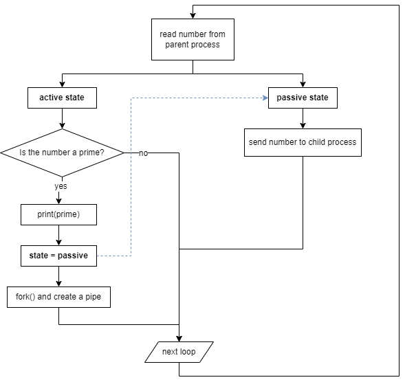

# [Lab Utilities](https://pdos.csail.mit.edu/6.828/2021/labs/util.html)

## primes *(hard)*

Use pipe and fork to set up the pipeline. The first process feeds the numbers 2 through 35 into the pipeline. For each prime number, you will arrange to create one process that reads from its left neighbor over a pipe and writes to its right neighbor over another pipe.


use pipes to transmit prime numbers

I set up a state machine for **all child processes**:



Note:

- All child processes should explicitly **wait for its own child** before exiting. This behavior guarantees the terminating order and printing correctness.

> What does main process do?
>

This process just creates the first process, set up a pipe. Then it sends 2~35 to the pipe and close the reading end `p[0]`

> How to setup the pipe?
>

Before `fork()`, the process creates a pipe. After `fork()`, child closes the writing end `p[1]`, and parent closes the reading end `p[0]`. This guarantees that only one process has the writing fd of each pipe.

> How does the process terminate?
>

After the main process closes the writing end, the first child will read from a pipe that has no writing end, which returns 0. Then the process jumps off the while loop and closes its own writing end, so the same process will happen on its child too. Finally, the last process terminates. And all waiting parent processes will terminate one by one in the reversed order.

- code

    ```c
    // user/primes.c
    int
    is_prime(int num) {
      for (int i = 2; i < num; i++)
        if (num % i == 0) return 0;
      return 1;
    }
    
    void
    rountine(int fd) {
      int state = 1;
      int num, n;
      int prev_fd = fd, next_fd = 1;
    
      while ((n = read(prev_fd, &num, 4)) > 0) {
        if (n != 4) {
          fprintf(2, "%d: read number shortcount error\n", getpid());
          exit(1);
        }
        if (state) {
          /* active, waiting to print the prime */
          if (is_prime(num)) {
            printf("prime %d\n", num);
            state = 0;  /* change to passive mode after printing */
    
            int p[2];
            pipe(p);    /* set up a pipe to the child process */
            if (fork() == 0) {
              prev_fd = p[0];
              next_fd = 1;
              close(p[1]);     /* child closes the writing end */
              state = 1;       /* child is active */
            }
            else {
              next_fd = p[1];
              close(p[0]);     /* parent closes the reading end */
            }
          }
        }
        else {
          /* passive, just pass the number to next process */
          write(next_fd, &num, 4);
        }
      }
      close(next_fd);
      wait(0);
    }
    
    int
    main(int argc, char *argv[])
    {
      /* create the first pipe */
      int p[2];
      if (pipe(p) < 0) {
        fprintf(2, "Error occurs when creating a pipe in main process.\n");
        exit(1); 
      }
    
      /* fork a child to execute rountine */
      if (fork() == 0) {
        close(p[1]);
        rountine(p[0]);
        exit(0);
      } else {
        close(p[0]);
        /* send numbers to pipe */
        for (int i = 2; i <= 35; i++) {
          write(p[1], &i, 4);
        }
        close(p[1]);    /* after sending, close the pipe */
    
        wait(0);
        exit(0);
      }
    }
    ```
